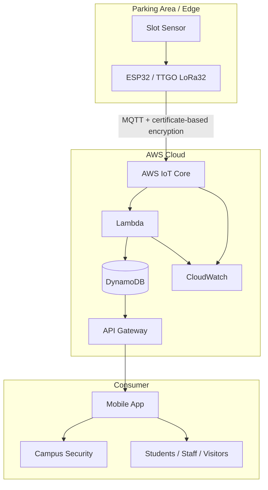

# Architecture

## System context

ParkPing models a smart-campus parking system where each parking slot exposes a binary occupancy state to a cloud-backed mobile experience.

## Architectural responsibilities

### Edge layer

The presentation proposes an HC-SR04 ultrasonic sensor connected to a microcontroller such as ESP32 or TTGO LoRa32. Its responsibility is to infer whether a slot is occupied and publish the resulting state.

### Messaging / ingestion layer

AWS IoT Core is the named MQTT-facing service. It represents the decoupling boundary between potentially many edge devices and downstream cloud logic.

### Processing layer

AWS Lambda is the named serverless compute component. A sensible responsibility in this architecture is validating/normalizing occupancy events and updating the current slot state. This responsibility is an architectural interpretation, not a claim of retained Lambda source code.

### Persistence layer

DynamoDB is the named persistence service. The presentation does not define a final table schema, so the example in `examples/dynamodb-item.example.json` is explicitly illustrative.

### API / application layer

API Gateway is the named API boundary between cloud data and the mobile-app concept. The presentation does not establish a final API contract.

### Observability layer

CloudWatch is included in the source architecture. Useful signals would include ingestion failures, Lambda errors, throttling, stale device telemetry, and API errors; these are production-readiness recommendations rather than retained implementation evidence.

## Architecture quality attributes

The source presentation emphasizes:

- near-real-time visibility;
- low-bandwidth MQTT communication;
- campus-wide extensibility;
- encrypted device communication;
- least-privilege access;
- privacy-friendly telemetry.

The portfolio keeps those goals separate from measured SLOs, because no latency, availability, load, or throughput measurements were provided.