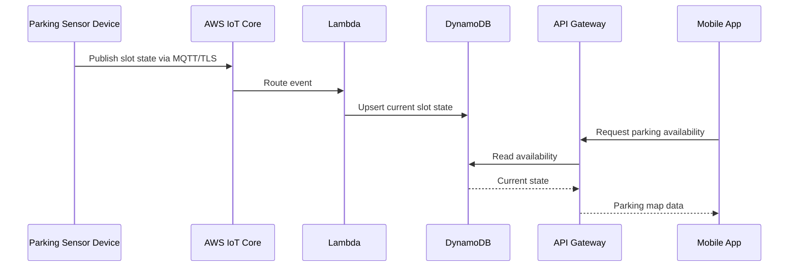

# AWS Architecture

## Services named in the presentation

| AWS service | Portfolio interpretation |
|---|---|
| AWS IoT Core | Secure MQTT ingress / device identity boundary |
| Lambda | Event-driven processing |
| DynamoDB | Parking-slot state persistence |
| API Gateway | Mobile-facing API boundary |
| CloudWatch | Operational monitoring / logs / alarms |

Only the **selection of these services** is verified by the source deck. No public AWS resource identifiers, Terraform/CloudFormation, runtime logs, or deployment screenshots were provided.

## Proposed request/event path

The exact routing integration between API Gateway and DynamoDB/Lambda was not defined in the source presentation. This sequence is a reference architecture showing one reasonable implementation.

## Suggested production controls

- Per-device X.509 certificates and narrowly scoped IoT policies.
- Topic namespace that prevents one sensor from publishing as another sensor.
- Lambda concurrency and retry controls.
- DynamoDB keys designed for parking-area queries rather than hot partitions.
- API authorization before exposing operational data beyond a public aggregate view.
- CloudWatch alarms for ingest failures and devices with stale heartbeats.
- Infrastructure as Code for reproducibility.

These are recommendations, not claims about the original camp implementation.