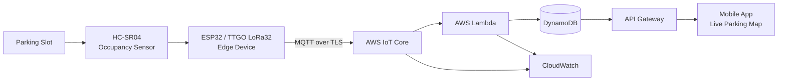

# ParkPing — Smart Campus IoT Parking Architecture

> A recruiter-facing architecture case study for real-time campus parking occupancy using IoT sensors, MQTT, and AWS serverless services.

**Project type:** Collaborative APIE Camp solution-design project  
**Role:** **Group Lead / Ketua Kelompok & Solution Architecture Contributor — Syifani Adillah Salsabila**  
**Team:** Group 2, four members  
**Status:** Architecture / solution design; production deployment is not claimed without retained implementation evidence


## Problem

Campus parking areas can become overcrowded during peak class hours. Drivers spend time searching for empty spaces, which can increase internal traffic congestion and make occupancy harder for campus security to monitor.

ParkPing was proposed as a smart-campus solution that makes parking-slot occupancy visible in near real time.

## Proposed solution

The project presentation defines three core functions:

1. Detect whether an individual parking slot is **occupied or empty**.
2. Send occupancy telemetry to AWS through **MQTT**.
3. Present current parking availability through a **mobile application**.

The proposed hardware options include an **ESP32**, **TTGO LoRa32**, and **HC-SR04 ultrasonic sensor**. The cloud architecture names **AWS IoT Core, Lambda, DynamoDB, API Gateway, and CloudWatch**.

## Architecture



> This diagram is a portfolio reconstruction of the architecture described in the presentation. It is not evidence of a production deployment.

## Evidence levels

| Claim | Evidence level | Basis |
|---|---|---|
| Campus parking problem and target users | **Verified from presentation** | Problem, impact, and target-user slides |
| Slot occupancy sensing concept | **Verified from presentation** | HC-SR04 + microcontroller hardware design |
| MQTT telemetry to AWS | **Verified from presentation** | Proposed-solution and IoT-flow slides |
| AWS IoT Core / Lambda / DynamoDB / API Gateway / CloudWatch | **Verified as architecture selection** | AWS-services slide |
| Mobile live parking-map concept | **Verified from presentation** | Proposed-solution and mobile-app slides |
| MQTT encryption with AWS certificates | **Verified as security requirement** | Security-considerations slide |
| Least-privilege IAM | **Verified as security requirement** | Security-considerations slide |
| No personal vehicle data stored | **Verified as privacy design goal** | Security-considerations slide |
| Hundreds of sensors / campus-wide expansion | **Design scalability claim** | Scalability slide; no load-test evidence retained |
| Physical sensor deployment | **Not claimed as verified** | No retained hardware-test evidence provided |
| Live AWS deployment | **Not claimed as verified** | No retained AWS console/log/resource evidence provided |
| End-to-end mobile application | **Not claimed as verified** | Presentation shows concept, not implementation proof |

## Executable data-contract example

The original presentation proves the **event-driven design**, but it does not preserve an exact historical production message schema. For portfolio review, this repository therefore includes an explicitly labeled **reference contract** that turns the documented MQTT → Lambda → DynamoDB flow into something inspectable and testable without pretending it was the original deployed payload.

```json
{
  "schema_version": 1,
  "device_id": "sensor-demo-001",
  "parking_area": "campus-a",
  "slot_id": "A-001",
  "occupied": true,
  "observed_at": "2026-01-01T08:00:00Z"
}
```

The contract is defined in [`schemas/parking-event.schema.json`](schemas/parking-event.schema.json). A corresponding DynamoDB materialized-state example is stored in [`examples/dynamodb-item.example.json`](examples/dynamodb-item.example.json).

[`scripts/validate_examples.py`](scripts/validate_examples.py) verifies that:

- the MQTT example conforms to the versioned JSON Schema;
- the DynamoDB partition/sort keys derive from parking-area and slot identity;
- slot, device, occupancy, and observed timestamp remain consistent across ingestion and materialized state;
- timestamps are timezone-aware; and
- only expected device-status values are used.

GitHub Actions runs this validation on pushes and pull requests via [`.github/workflows/contract-validation.yml`](.github/workflows/contract-validation.yml).

> Passing this CI proves consistency of the **portfolio contract artifacts only**. It does not prove that physical sensors, AWS IoT Core, Lambda, DynamoDB, or the mobile application were deployed historically.

## Why MQTT fits this problem

Parking sensors produce small state-change events rather than large request/response payloads. MQTT gives the design a lightweight publish/subscribe model where edge devices can publish occupancy events without being tightly coupled to the mobile application or persistence layer.

The proposed event boundary also allows cloud processing, storage, monitoring, and client APIs to evolve independently.

## Security and privacy by design

The presentation explicitly includes:

- encrypted MQTT using AWS certificates;
- strict IAM minimal-privilege policies;
- no personal vehicle data stored.

This repository expands those requirements into a practical threat model without claiming that every control was implemented. See [SECURITY.md](SECURITY.md), [PRIVACY.md](PRIVACY.md), and [docs/THREAT_MODEL.md](docs/THREAT_MODEL.md).

## Team and leadership

| Member | Role in this portfolio record |
|---|---|
| **Syifani Adillah Salsabila** | **Group Lead / Ketua Kelompok & Solution Architecture Contributor** |
| Regina Nathania Agussalim | Team Member |
| Kesha Mufrih Ramadhan | Team Member |
| Nurulfaizal Bin M Shukeri | Team Member |

The presentation verifies the four-person Group 2 membership. The **Group Lead** designation is recorded from Syifani's own project context and is not presented as if it were printed on the slide deck.

## Repository guide

- [Architecture](ARCHITECTURE.md)
- [IoT data flow](IOT_DATA_FLOW.md)
- [AWS architecture](AWS_ARCHITECTURE.md)
- [Security](SECURITY.md)
- [Privacy](PRIVACY.md)
- [Scalability](SCALABILITY.md)
- [Validation plan](VALIDATION_PLAN.md)
- [Reference event schema](schemas/parking-event.schema.json)
- [Executable contract validator](scripts/validate_examples.py)
- [Limitations](LIMITATIONS.md)
- [Team attribution](TEAM_ATTRIBUTION.md)
- [Source evidence](SOURCE_EVIDENCE.md)
- [Portfolio / CV copy](PORTFOLIO.md)
- [Evidence map](docs/EVIDENCE_MAP.md)
- [Production-readiness roadmap](docs/PRODUCTION_READINESS.md)

## Scope note

ParkPing should be read as an **IoT/cloud solution-architecture project** based on the retained Group 2 presentation. This repository intentionally separates what the presentation proves from what would still need implementation and validation before calling the system production-ready.
